# 1. What is OAuth?
OAuth is an authorization framework that allows applications to request limited, specific access to a user's account on another platform — without the user ever revealing their password to the requesting app. Instead of sharing full credentials, the user grants a scoped access token, keeping their login details private while still enabling third-party functionality. OAuth is commonly used both for data integration (like accessing contacts) and for authentication (like "Login with Google"). The current standard is OAuth 2.0, which is a complete rewrite of the older 1.0a.
# 2. How does OAuth 2.0 work?
>**Example:** Spotify muốn lấy danh sách bạn bè Facebook của bạn
>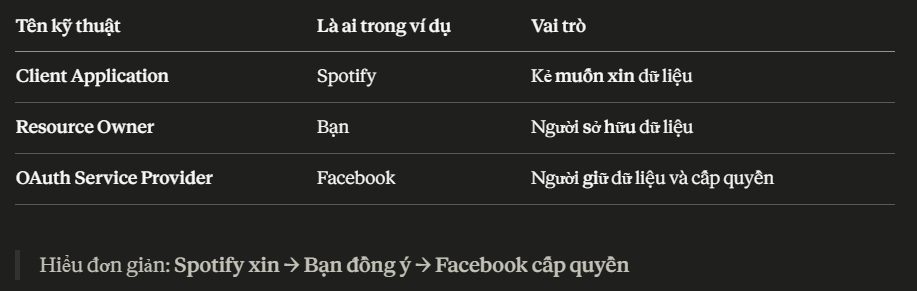

> [!TIP]
> OAuth "flows" / "grant types" là gì?
>Chỉ là các cách khác nhau để thực hiện quá trình xin quyền đó.
>
>Giống như "chuyển tiền" có thể làm bằng nhiều cách: ATM, internet banking, chuyển tay... Kết quả giống nhau nhưng quy trình khác nhau.
> Hai loại phổ biến nhất:
> - Authorization Code — an toàn hơn, dùng cho web app
> - Implicit — đơn giản hơn, cũ hơn

> [!NOTE]
> Quy trình cơ bản:
> **Example:**
>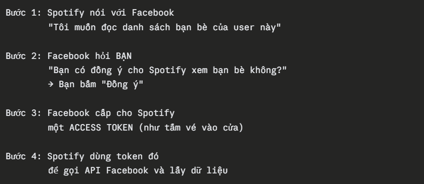

# 3. OAuth grant types
> **Grant Type** = "kịch bản" mà OAuth sẽ chạy theo để hoàn thành quá trình cấp quyền.
> 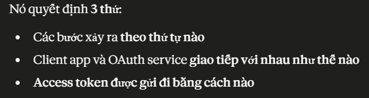

> [!TIP]
> OAuth scopes
> **Scope** = danh sách cụ thể những gì client app được phép làm/xem 
> 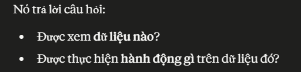

> [!IMPORTANT]
> URI & URL?
> 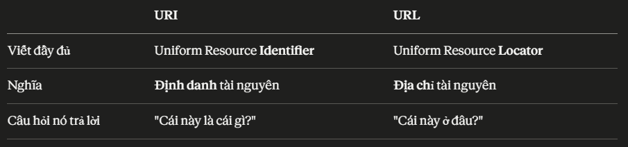

> [!NOTE]
> AUTHORIZATION CODE GRANT TYPE
> 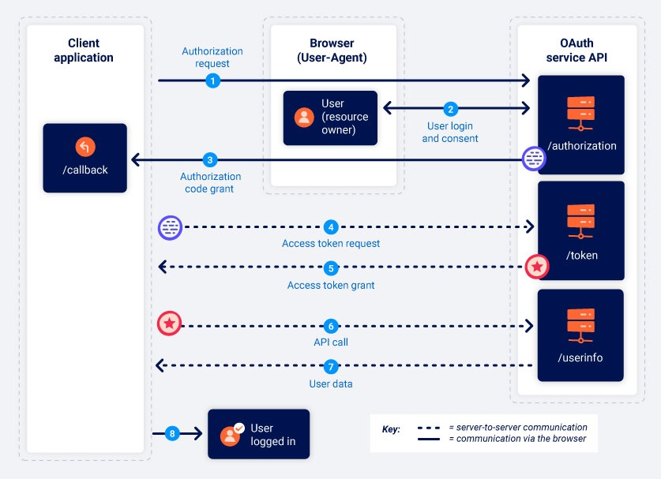
> 
> **Client secret là gì?**
> 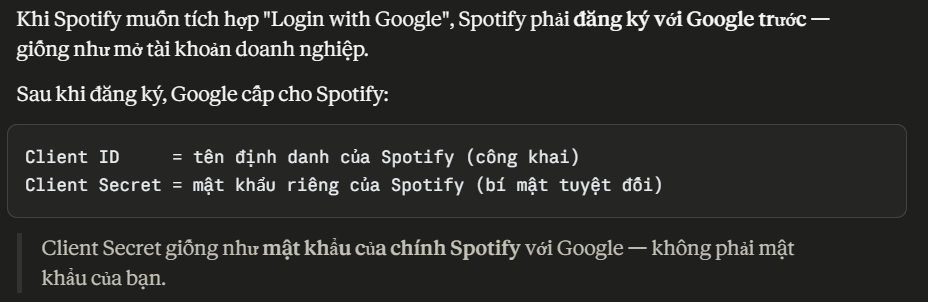

1. Authorization request
> The client application sends a request to the OAuth service's /authorization endpoint asking for permission to access specific user data. Note that the endpoint mapping may vary between providers - our labs use the endpoint /auth for this purpose. However, you should always be able to identify the endpoint based on the parameters used in the request.
> ```
> GET /authorization?client_id=12345&redirect_uri=https://client-app.com/callback&response_type=code&scope=openid%20profile&state=ae13d489bd00e3c24 HTTP/1.1
>Host: oauth-authorization-server.com
> ```
> - **state:** Mã bí mật để xác nhận response nhận về là hợp lệ, không bị giả mạo
> - **redirect_uri:** Địa chỉ để nhận Authorization Code gửi về
> - **client_id:** ID định danh của app đang xin quyền.

2. User login and consent (chấp thuận)
> Khi nhận yêu cầu, authorization server chuyển hướng người dùng đến trang đăng nhập của OAuth provider. Sau khi đăng nhập, người dùng sẽ được hỏi cấp quyền truy cập dữ liệu dựa trên các scope. Nếu đã từng chấp thuận trước đó và vẫn còn phiên đăng nhập hợp lệ, bước này sẽ được tự động bỏ qua, cho phép đăng nhập nhanh chỉ với một lần nhấn.

3. Authorization code grant
> If the user consents to the requested access, their browser will be redirected to the **/callback** endpoint that was specified in the **redirect_uri** parameter of the authorization request. The resulting GET request will contain the authorization code as a query parameter. Depending on the configuration, it may also send the **state** parameter with the same value as in the authorization request.
> ```
> GET /callback?code=a1b2c3d4e5f6g7h8&state=ae13d489bd00e3c24 HTTP/1.1
> Host: client-app.com
> ```

4. Access tokent request
> Once the client application receives the authorization code, it needs to exchange it for an access token. To do this, it sends a server-to-server POST request to the OAuth service's /token endpoint. All communication from this point on takes place in a secure back-channel and, therefore, cannot usually be observed or controlled by an attacker.
> ```
>POST /token HTTP/1.1
>Host: oauth-authorization-server.com
>…
>client_id=12345&client_secret=SECRET&redirect_uri=https://client-app.com/callback&grant_type=authorization_code&code=a1b2c3d4e5f6g7h8
> ```

5. Access token grant
> The OAuth service will validate the access token request. If everything is as expected, the server responds by granting the client application an access token with the requested scope. 
> ```
> {
>    "access_token": "z0y9x8w7v6u5",
>    "token_type": "Bearer",
>    "expires_in": 3600,
>    "scope": "openid profile",
>    …
> }
> ```

6. API call
> Now the client application has the access code, it can finally fetch (tìm về) the user's data from the resource server. To do this, it makes an API call to the OAuth service's **/userinfo** endpoint. The access token is submitted in the **Authorization:** Bearer header to prove that the client application has permission to access this data. 
> ```
> GET /userinfo HTTP/1.1
> Host: oauth-resource-server.com
> Authorization: Bearer z0y9x8w7v6u5
> ```

7. Resource grant
> The resource server should verify that the token is valid and that it belongs to the current client application. If so, it will respond by sending the requested resource i.e. the user's data based on the scope of the access token.
> ```
> {
>    "username":"carlos",
>    "email":"carlos@carlos-montoya.net",
>    …
> }
> ```

> [!NOTE]
> IMPLICIT GRANT TYPE
> 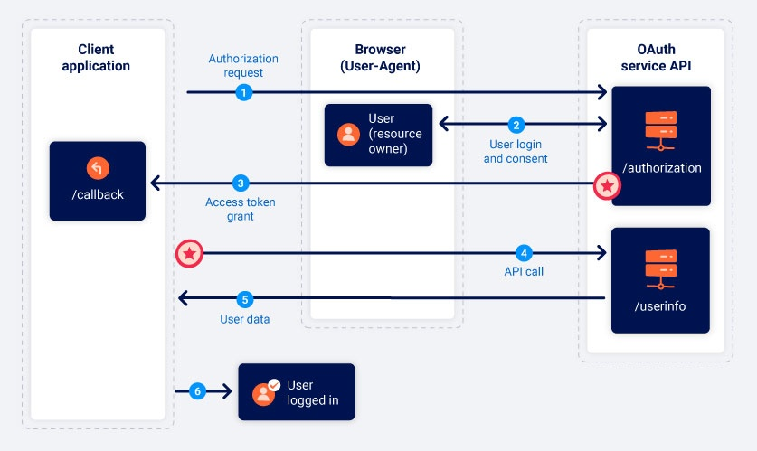
> Implicit flow trả về access token trực tiếp sau khi người dùng đồng ý, bỏ qua bước đổi code. Tuy đơn giản hơn, nhưng kém an toàn vì token được truyền qua browser. Flow này phù hợp với ứng dụng không có backend, nhưng hiện nay ít được dùng.

1. Authorization request
> The implicit flow starts in much the same way as the authorization code flow. The only major difference is that the **response_type** parameter must be set to **token**.
> ```
> GET /authorization?client_id=12345&redirect_uri=https://client-app.com/callback&response_type=token&scope=openid%20profile&state=ae13d489bd00e3c24 HTTP/1.1
> Host: oauth-authorization-server.com
> ```

2. User login and consent
> The user logs in and decides whether to consent to the requested permissions or not. This process is exactly the same as for the authorization code flow.

3. Access token grant
> ```
> GET /callback#access_token=z0y9x8w7v6u5&token_type=Bearer&expires_in=5000&scope=openid%20profile&state=ae13d489bd00e3c24 HTTP/1.1
> Host: client-app.com
> ```

4. API call
> Once the client application has successfully extracted the access token from the URL fragment, it can use it to make API calls to the OAuth service's **/userinfo** endpoint. Unlike in the authorization code flow, this also happens via the browser.
> ```
> GET /userinfo HTTP/1.1
> Host: oauth-resource-server.com
> Authorization: Bearer z0y9x8w7v6u5
> ```

5. Resource grant
> The resource server should verify that the token is valid and that it belongs to the current client application. If so, it will respond by sending the requested resource i.e. the user's data based on the scope associated with the access token.
> ```
> {
>    "username":"carlos",
>    "email":"carlos@carlos-montoya.net"
> }
> ```

# 4. OAuth authentication
> [!TIP]
> SAML và SSO đóng vai trò gì?
> 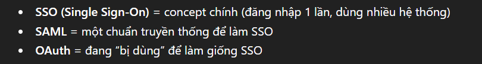
> 👉 OAuth authentication = SSO-like (giống SSO nhưng không phải SSO chuẩn)
> 👉 Và đây là chỗ dễ có lỗ hổng bảo mật

> [!TIP]
> **Improper implementation of the implicit grant type:**
> 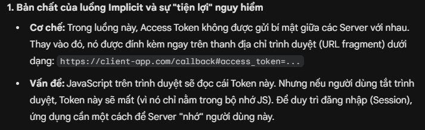
> 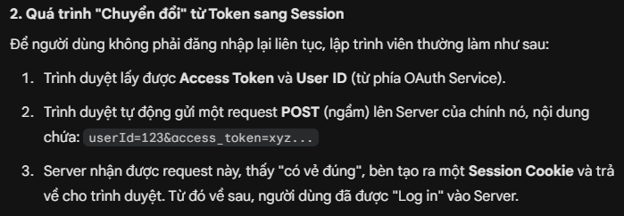
> 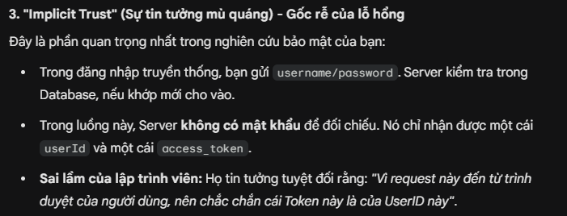
> 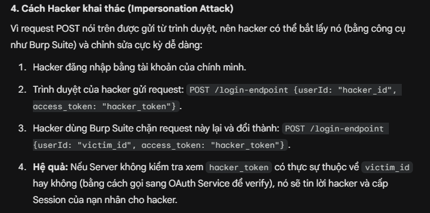

**Example:**
> POST: là phương thức gửi yêu cầu lên server
> 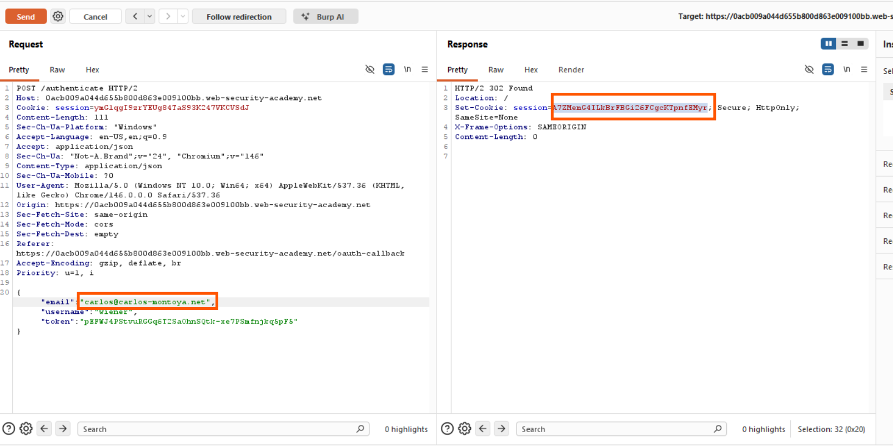
> Lấy session để đăng nhập
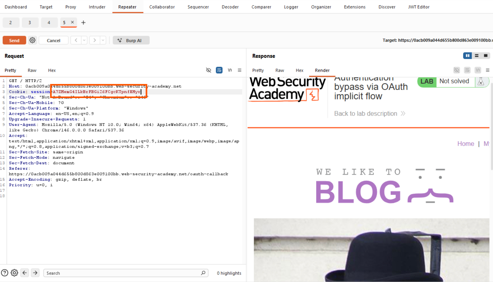

# 5. How vulnerabilities arise
> 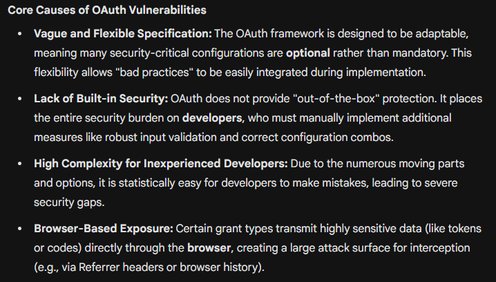

> [!TIP]
> Identifying OAuth authentication
> 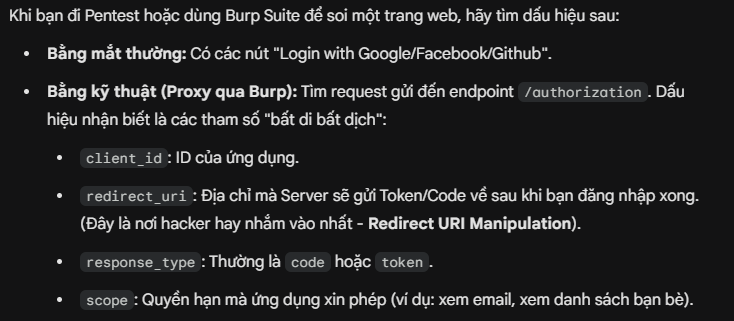

> [!NOTE]
> Recon (Thăm dò):
> 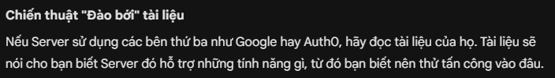
> 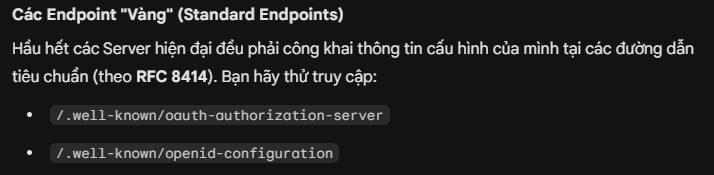
> 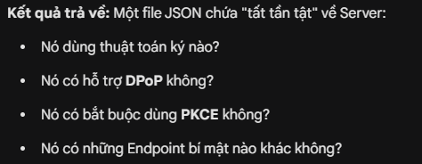
 
# 6. Exploiting vulnerabilities
**1. Flawed CSRF protection:**

# 7. OpenID Connect
> **Link:** https://portswigger.net/web-security/oauth/preventing

# 8. Preventing vulnerabilities
> **Link:** https://portswigger.net/web-security/oauth/preventing

