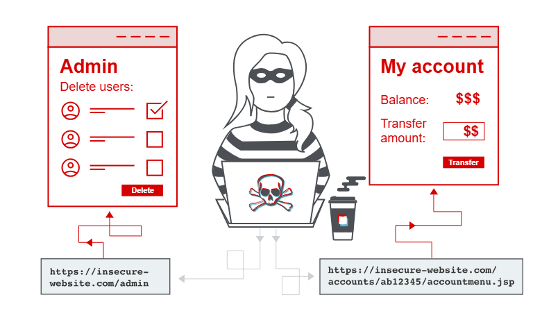
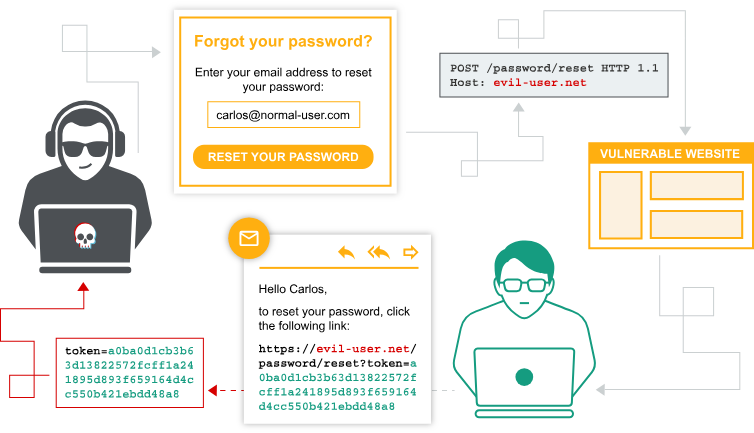
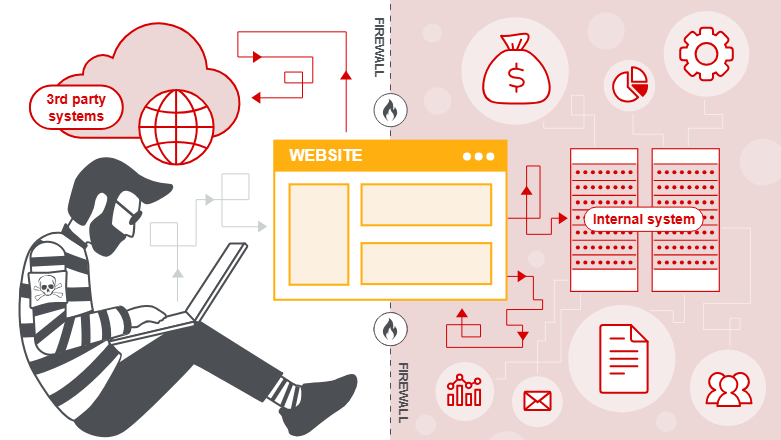

# 1. Path traversal
### Introduction:
Path traversal is also known as directory traversal. These vulnerabilities enable anable an attacker to read files on the server that is running an application. This might include:

- Application code and data.
- Credentials for back-end systems.
- Sensitive operatin system files

> [!IMPORTANT]
> Technique:

**Example:** The website loads an image using the following HTML:
```

```
- That image files are stored on disk in the location `/var/www/images/`.
- The server concatenates this base directory with the filename parameter:
 `/var/www/images/ + filename`

As a result, the file path in this example is:
```
/var/www/images/218.png
```

An attacker can exploit this behavior by requesting the following URL:
```
https://insecure-website.com/loadImage?filename=../../../etc/passwd
```
The server constructs the file path as follows:
```
/var/www/images/../../../etc/passwd
```
This causes the application to read the following file: `/etc/passwd`

> [!TIP]
> Mindset:
1. `../`: is a directory traversal operator that moves one level up in the directory structure.
2. On Windows, both `../` and `..\` are valid directory traversal sequences. The following is an example of an equivalent attack against a Windows-based server:
    ```
    https://insecure-website.com/loadImage?filename=..\..\..\windows\win.ini
    ```

> [!NOTE]
> > Vocab:
> - credential: thông tin xác thực.
> - traversal: di chuyển.
> - construct: tạo 
# 2. Access control 
### Introduction:

Access control is the application of constraints on who or what is authorized to perform actions or access resources. In the context of web applications, access control is dependent on authentication and sesion management:
- **Authentication** verifies the user's identity.
- **Session management** identifies which subsequent HTTP requests are being made by that same user.
- **Authorization** (Access control) checks whether the user is permitted to perform a specific action.

**Vertical privilege escalation:**
- When a user gains access to functionality
reserved for a higher-privileged role.
- Example: A non-admin user can access an admin page and perform administrative actions.

**Horizontal privilege escalation:**
- Horizontal privilege escalation occurs if a user is able to gain access to resources belonging to another user, instead of their own resources of that type. 
- Example: if an employee can access the records of other employees as well as their own.

> [!NOTE]
> > - Horizontal privilege escalation attacks may use similar types of exploit methods to vertical privilege escalation (sửa request/parameter).
> - Dùng GUID thay vì số tăng dần không phải là giải pháp an toàn tuyệt đối.
> [!IMPORTANT]
> Technique:
1. **Unprotected functionality:**
    A user may be able to access administrative functionality by directly browsing to the relevant admin URL, even if it is not exposed in the user interface.
    
    _Example 1:_ **Direct access to an admin endpoint**
    ```
    https://insecure-website.com/admin
    ```
    In some cases, the administrative URL might be disclosed in other locations, such as the `robots.txt` file
    
    _Example 2:_ **Information disclosure via robots.txt**
    ```
    https://insecure-website.com/robots.txt
    ```
    In other scenarios, administrative functionality is hidden using an unpredictable URL (security by obscurity). However, the URL may still be leaked through client-side code.

    The following script adds an admin link to the UI only if the user is an administrator.
    
    However, the JavaScript file containing the admin URL is visible to all users, regardless of their role.
    ```
    <script>
        var isAdmin = false;
        if (isAdmin) {
		...
            var adminPanelTag = document.createElement('a');
            adminPanelTag.setAttribute('href', 'https://insecure-website.com/administrator-panel-yb556');
            adminPanelTag.innerText = 'Admin panel';
            ...
        }
    </script>
    ```
    
2. **Parameter-based:**
    Some applications determine the user's access rights or role at login, and then store this information in a user-contrllable location. This could be:
    - A hidden field.
    - A cookie. 
    - A preset query string parameter.
    
    _Example:_ **The application makes access control decisions based on the submitted value.**
    ```
    https://insecure-website.com/login/home.jsp?admin=true
    https://insecure-website.com/login/home.jsp?role=1
    ```
    
3. **Horizontal to vertical privilege escalation**

# 3. Authentication
### Introduction:

**What is the difference between authentication and authorization?**
- `Authentication` is the process of verifying who a user is.
- `Authorization` is the process of determining what a user is allowed to do.

Authentication happens first, then authorization is applied.

Example:
- Authentication verifies that the user logging in as Carlos123 is the legitimate account owner.
- Authorization determines whether Carlos123 has permission to access certain data or perform specific actions, such as deleting another user’s account.

> [!IMPORTANT]
> Technique:
1. **Brute-force attacks** 
    A brute-force attack uses trial and error to guess valid usernames and passwords. Attacks are usually automated with tools and wordlists. Automation allows attackers to make many login attempts very quickly.
    
    - **Smarter brute-forcing:** 
    Attackers use: 
        - logic
        - public information`
        - common patterns
    - **Brute-forcing usernames:**
        - Usernames are often predictable:
            - Email formats: (firstname.lastname@company.com)
            - Common names (admin, administrator)
        - During testing, check for username disclosure:
            - Public user profiles
            - Error messages
            - HTTP responses leaking email addresses
    - **Brute-forcing passwords:** 
        - Password strength depends on entropy.
        - Password policies often require:
            - Minimum length
            - Uppercase + lowercase letters
            - Special characters 
    
2. **Username enumeration**
    Username enumeration is when an attacker is able to observe changes in the website's behavior in order to identify whether a given username is valid.
    
    This usually happens on:
    - Login pages (valid username + wrong password or invalid username)
    - Registration pages (username already taken)

    Behavioral differences may include:
    - Error messages
    - Response timing
    - HTTP status codes

    Username enumeration significantly reduces the effort needed for brute-force attacks by allowing attackers to build a list of valid usernames.
    
3. **Bypassing two-factor authentication**
    Two-factor authentication (2FA) can sometimes be implemented incorrectly.

    In some applications, users are considered logged in after entering the password, before completing the second factor.

    The verification code is requested on a separate page, but access control may not be enforced properly.

    An attacker may be able to skip the 2FA step by directly accessing pages that require a logged-in user.

    This happens when the application does not verify whether the second authentication step was completed.

> [!TIP]
> Tip:
Authentication = identity
Authorization = permissions

> [!NOTE]
> > Vocab:
# 4. Server-side request forgery (SSRF)
### Introduction:

**SSRF** is a vulnerability that allows an attacker to make the server send requests to unintended locations.

Attackers can force the server to:
- Access internal-only services within the organization
- Connect to arbitrary external systems

SSRF can lead to sensitive data exposure, such as:
- Internal service data.
- Authorization credentials

> [!IMPORTANT]
> Technique:
1. **SSRF attacks against the server**
    In an SSRF attack against the server, an attacker forces the application to make an HTTP request back to itself.

    This is usually done using loopback addresses such as:
    - 127.0.0.1
    - localhost
    
    The server trusts requests coming from its own local network interface.
    
    **Example:** A shopping application checks product stock by requesting a back-end API. When a user views stock information, the browser sends:
    ```
    POST /product/stock HTTP/1.0
    Content-Type: application/x-www-form-urlencoded
    Content-Length: 118
   
   stockApi=http://stock.weliketoshop.net:8080/product/stock/check%3FproductId%3D6%26storeId%3D1
    ```
    The server fetches the URL and returns the stock status to the user.
    
    An attacker can modify the request to point to a local URL:
    ```
    POST /product/stock HTTP/1.0
    Content-Type: application/x-www-form-urlencoded
    Content-Length: 118

    stockApi=http://localhost/admin
    ```
    The server then requests `/admin` from itself and returns the response.

> [!TIP]
> Note:
**Why this work?**
Applications often trust requests from the local machine, which makes SSRF especially dangerous.

Common reasons:
- Access control is enforced elsewhere
→ A front-end component performs the check, so internal requests bypass it.
- Disaster recovery mechanisms
→ Admin access may be allowed without authentication for requests coming from localhost.
- Admin interface on a different port
→ Not directly accessible to users, but reachable internally by the server.

2. **SSRF attacks against other back-end systems**
    In some SSRF cases, the application server can access internal back-end systems that are not directly reachable by users.

    These systems usually use private, non-routable IP addresses (e.g. 192.168.x.x).

    Because they are protected by network isolation, back-end systems often:
    - Have weaker security
    - Expose sensitive functionality without authentication
    
    SSRF allows attackers to abuse the application server as a proxy to access these internal systems.
    
    **Example:** An internal administrative interface exists at:
    ```
    https://192.168.0.68/admin
    ```
    An attacker can exploit the SSRF vulnerability by sending:
    ```
    POST /product/stock HTTP/1.0
    Content-Type: application/x-www-form-urlencoded
    Content-Length: 118

    stockApi=http://192.168.0.68/admin
    ```
    The application server makes the request on the attacker’s behalf and returns the response.
    
> [!NOTE]
> > Vocab:
# 5. File upload vulnerabilitie 
### Introduction:
File upload vulnerabilities are when a web server allows user to upload files to its filesystem without sufficiently validating things like their name, type, contents, or size.

This could even include server-side script files that enable remote code execution.
    
> [!IMPORTANT]
> Technique:
1. **Exploiting unrestricted file uploads to deploy a web shell**
When a website allows you to upload server-side scripts, such as PHP, Java, Python files, and so on.
    :::spoiler **Web shell**
    A web shell is a malicious script that enables an attacker to execute arbitrary (tùy ý) commands on a remote web server simply by sending HTTP requests to the right endpoint.
    :::
    _Example_:
    ```
    <?php echo file_get_contents('/path/to/target/file'); ?> 
    ```
    Cách này giúp ta lấy trực tiếp nội dung trong file thông qua hàm đã có trong file php mà ta tải lên.
    
    A versatile (linh hoạt) web shell may return something like this:
    ```
    <?php echo system($_GET['command']); ?>
    ```
    This scripts enables you to pass an arbitrary system command via a query parameter as follows:
    ```
    GET /example/exploit.php?command=id HTTP/1.1
    ```
    Cách này là hướng đi khác giúp ta có thể thao tác với URL thông qua command. 
    Ví dụ: `?command=cat+/path/to/target/file`
    
2. **Flawed file type validation**
    The server validates the uploaded file only by checking the Content-Type header, for example:
    ```
    Content-Type: image/jpeg
    ```
    The server does not verify the actual file content (file signature, magic bytes, or structure).
    
    **Structure of a `multipart/form-data` Request**
    Example upload request:
    ```
    POST /images HTTP/1.1
    Host: normal-website.com
    Content-Length: 12345
    Content-Type: multipart/form-data; boundary=---------------------------012345678901234567890123456

    ---------------------------012345678901234567890123456
    Content-Disposition: form-data; name="image"; filename="example.jpg"
    Content-Type: image/jpeg

    [...binary content of example.jpg...]

    ---------------------------012345678901234567890123456
    Content-Disposition: form-data; name="description"

    This is an interesting description of my image.

    ---------------------------012345678901234567890123456
    Content-Disposition: form-data; name="username"

    wiener
    ---------------------------012345678901234567890123456--
    ```
   Explanation:
    - `boundary`: separates each form field.
    - Each part contains:
        - `Content-Disposition`: field name and filename
        - `Content-Type`: MIME type of that specific field
    - Many servers only check this MIME type, which is user-controlled.
    
> [!TIP]
> Mindset:

1. Check if uploaded files are stored on disk?
2. Identify executable file types on the server
3. Analyze upload filters and possible bypasses
4. Locate the upload directory and test file execution


> [!NOTE]
> > Vocab:
> - parse: cú pháp
> - arise: phát sinh
> - ultimately: cuối cùng
> - discrepancies: nhưng sai lệch
> - more commonly: thông thường
> - robust validation: xác thực mạnh mẽ
> - inherently flawed: bản chất có lỗi
> - obscure file types: các loại tệp ít phổ biến
# 6. OS command injection
### Introduction:
OS command injection allows an attacker to execute operating system (OS) commands on the server that is running an application, and typically fully compromise the application and its data.

Some initial commands to gather information about the system:


| Purpose | Linux   | Windows |
| -------- | ------- | -------- |
| Name of curent user | whoami | whoami |
| OS | uname -a | ver |
|Network configuration| ifconfig | ifconfig/all |
|Network connections | netstat -an | netstat -an |
|Running processes | ps -ef | tasklist |

> [!IMPORTANT]
> Technique:

**Example:** a shopping application lets the user view whether an item is in stock in a particular store. This information is accessed via a URL:
```
https://insecure-website.com/stockStatus?productID=381&storeID=29
```
This command outputs the stock status for the specified item, which is returned to the user:
```
stockreport.pl 381 29
```
The application implements no defenses against OS command injection, so an attacker can insert `&` character to execute arbitrary command.

If the attacker sends the following input in the `productID` parameter (URL):
```
& echo aiwefwlguh &
```
the server will build and execute this command:
```
stockreport.pl & echo aiwefwlguh & 29
```

Here, the `&` character is a shell command separator, causing three separate commands to run:
1. stockreport.ph -> lỗi vì thiếu tham số
2. echo aiwefwlguh -> in ra chữ aiwefwlguh
3. 29 -> shell cố chạy số 29 như lệnh -> báo lỗi

The resulting output is:
```
Error - productID was not provided
aiwefwlguh
29: command not found
```
Placing the additional command separator `&` after the injected command is useful because it separates the injected command from whatever follows the injection point. This `reduces` the chance that what follows will prevent the `injected command` from executing

> [!TIP]
> Mindset:

Quan sát request POST:
Ví dụ: Ta injection `uname -a` vào payload:
```
POST /product/stock HTTP/2
Host: <your-lab-id>.web-security-academy.net
Content-Type: application/x-www-form-urlencoded
Cookie: session=...

productId=3&storeId=1;uname -a;
```

**Một số cách injection vào payload để tách lệnh**:
`&id&`, `;id;`, `|id`, `||id`, `$(id)`,...

> [!NOTE]
> > Vocab:
> - injection: sự tiêm nhiễm
> - compromise: chiếm quyền/xâm phạm
> - pivot: chuyển hướng
> - stock: tồn kho/còn hàng không?
> - legacy system: hệ thống cũ
# 7. SQL injection (SQLi)
### Introduction:
SQL injection (SQLi) is a web security vulnerability that allows an attacker to interfere (can thiệp) with the queries that an application makes to its database. 

This can allow an attacker to view data that they are not normally able to retrieve (lấy). In many cases, an attacker can modify or delete this data, causing persistent changes to the application's content or behavior.

In some situations, an attacker can escalate a SQL injection attack to compromise the underlying server or other back-end infrastructure. It can also enable them to perform denial-of-service attacks.

### How to dectect SQL injection vulnerabilities?
You can detect SQL injection manually using a systematic set of tests against every entry point in the application. To do this, you would typically submit:
- The single quote character `'` and look for errors or other anomalies.
- Some SQL-specific syntax that evaluates to the base (original) value of the entry point, and to a different value, and look for systematic differences in the application responses.
- Boolean conditions such as `OR 1=1` and `OR 1=2`, and look for differences in the application's responses.
- Payloads designed to trigger time delays when executed within a SQL query, and look for differences in the time taken to respond.
- OAST payloads designed to trigger an out-of-band network interaction when executed within a SQL query, and monitor any resulting interactions.

Alternatively, you can find the majority of SQL injection vulnerabilities quickly and reliably using Burp Scanner.

> [!IMPORTANT]
> Technique:
1. **Retrieving hidden data:**
**Example:** Imagine a shopping application that displays products in different categories. When the user clicks on the Gifts category, their browser requests the URL:
    ```
    https://insecure-website.com/products?category=Gifts
    ```
    This causes the application to make a SQL query to retrieve details of the relevant products from the database:
    ```
    SELECT * FROM products WHERE category = 'Gifts' AND released = 1
    ```
    The restriction released = 1 is being used to hide products that are not released. We could assume for unreleased products, released = 0.
    
    
    The application doesn't implement any defenses against SQL injection attacks. This means an attacker can construct the following attack, for example:
    ```
    https://insecure-website.com/products?category=Gifts'--
    ```
    This results in the SQL query:
    ```
    SELECT * FROM products WHERE category = 'Gifts'--' AND released = 1
    ```
    
    You can use a `similar attack` to cause the application to display all the products in any category, including categories that they don't know about:
    ```
    https://insecure-website.com/products?category=Gifts'+OR+1=1--
    ```
    This results in the SQL query:
    ```
    SELECT * FROM products WHERE category = 'Gifts' OR 1=1--' AND released = 1
    ```
    The modified query returns all items where either the category is Gifts, or 1 is equal to 1. As 1=1 is always true, the query returns all items.
    
> [!WARNING]
> Take care when injecting the condition OR 1=1 into a SQL query. Even if it appears to be harmless in the context you're injecting into, it's common for applications to use data from a single request in multiple different queries. If your condition reaches an UPDATE or DELETE statement, for example, it can result in an accidental loss of data.
    
2. **Subverting application logic:**
**Example:** Imagine an application that lets users log in with a username and password. If a user submits the username wiener and the password bluecheese, the application checks the credentials by performing the following SQL query:
    ```
    SELECT * FROM users WHERE username = 'wiener' AND password = 'bluecheese'
    ```
    If the query returns the details of a user, then the login is successful. Otherwise, it is rejected.
    
    In this case, an attacker can log in as any user without the need for a password. They can do this using the SQL comment sequence `--` to remove the password check from the `WHERE` clause of the query. For example, submitting the username `administrator'--` and a blank password results in the following query:
    ```
    SELECT * FROM users WHERE username = 'administrator'--' AND password = ''
    ```

> [!TIP]
> Mindset:
1. `--`: dùng để làm tất cả những gì đứng sau nó sẽ bị bỏ qua và không được SQL thực thi.
    
    
> [!NOTE]
> > Vocab:
> - underlying: xâm nhập
> - anomalies: bất thường
> - trigger time: thời gian kích hoạt