New vocabulary:
1. various stakeholders /ˈsteɪkhəʊldər/: nhiều bên liên quan 
2. be integral /ɪnˈteɡrəl/ /ˈɪntɪɡrəl/ : không thể thiếu
3. exonerating /ɪɡˈzɒnəreɪt/ the innocent: thanh minh cho người vô tội
4. policy violations /ˌvaɪəˈleɪʃn/: vi phạm chính sách
5. setting the joke aside
6. refrigerator /rɪˈfrɪdʒəreɪtər/: tủ lạnh
7. pave the way for: mở đường cho
8. analogy /əˈnælədʒi/ (between A and B)|(with something): a comparison of one thing with another thing that has similar features; a feature that is similar
9. confidentiality /ˌkɒnfɪˌdenʃiˈæləti/
10. punctuation: dấu câu

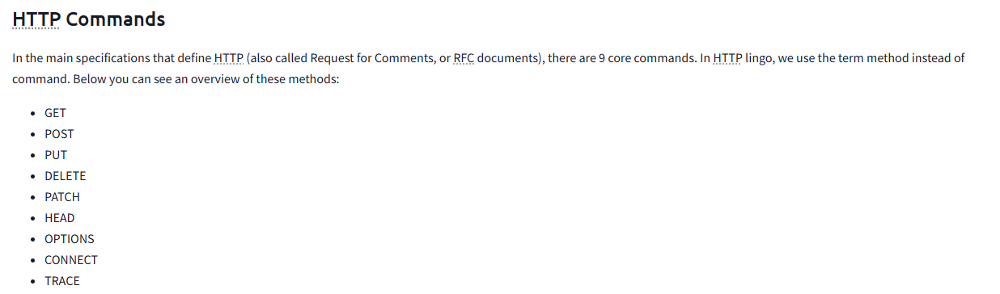
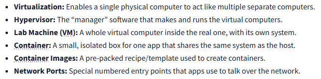
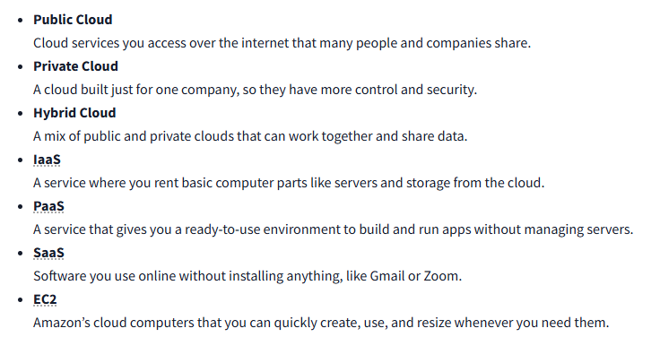

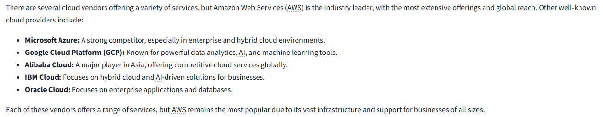
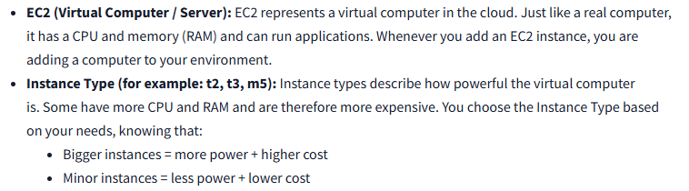
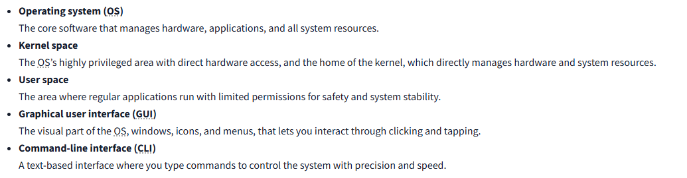
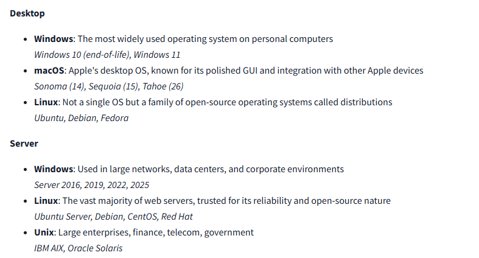
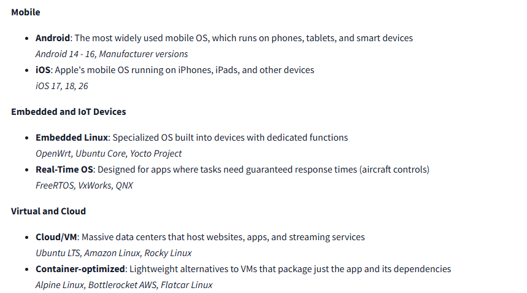
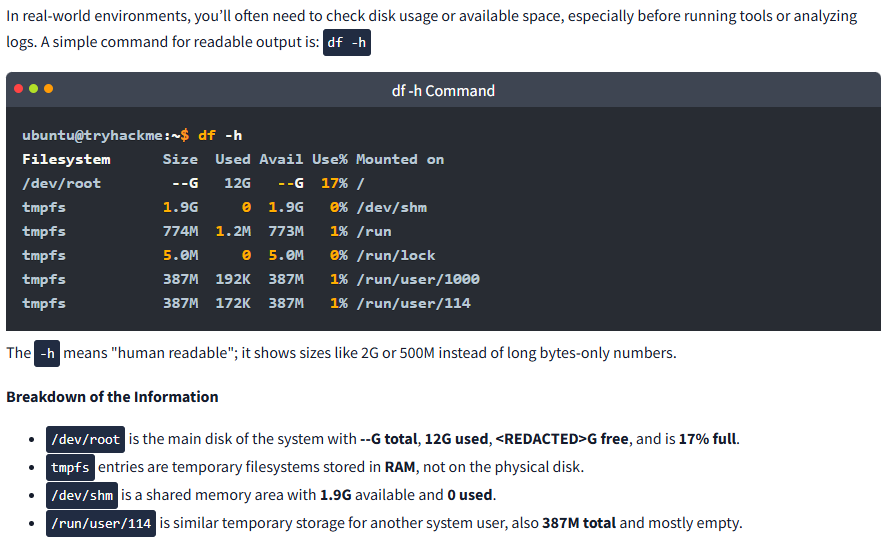

Linux stores configuration and informational files in the /etc directory.

To become familiar with window cli:
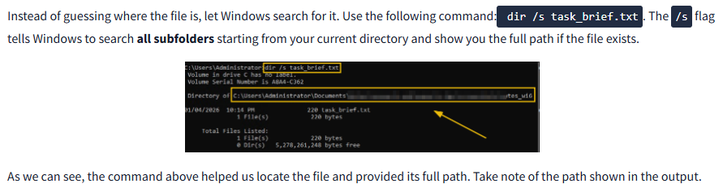
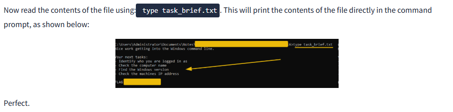
Before fixing a problem or investigating an incident, they first want to know:
- Who am I logged in as? 
- What machine is this?
- What version of Windows is it running?
- How is it connected to the network?