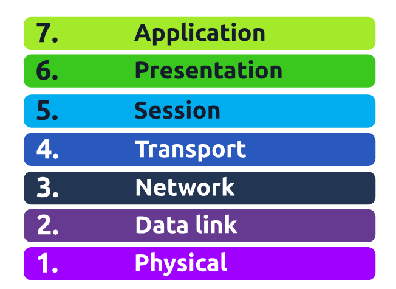
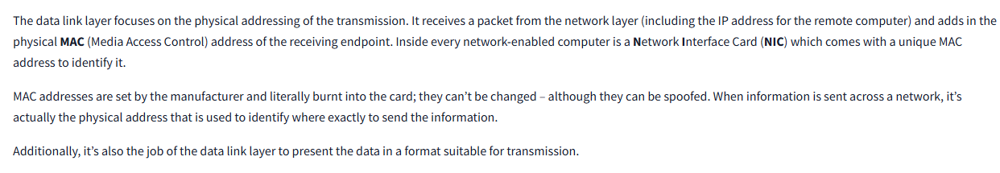
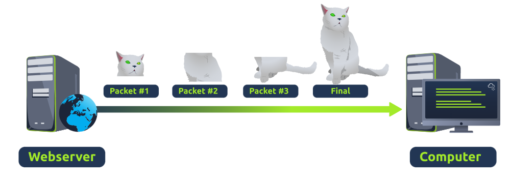
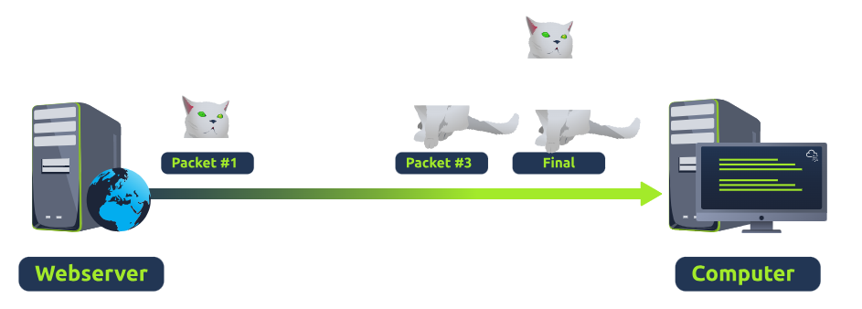

**Mô hình OSI (Open Systems Interconnection Model):** One of the main benefits of the OSI model is that devices can have different functions and designs on a network while communicating with other devices. Data sent across a network that follows the uniformity of the OSI model can be understood by other devices.

**In network layer:** OSPF (Open Shortest Path First) and RIP (Routing Information Protocol)

**In transport layer:** The Transmission Control Protocol (TCP) and User Datagram Protocol (or UDP for short)
**Example 1: TCP**

**Example 2: UDP**

Once data has been correctly translated or formatted from the presentation layer (layer 6), **the session layer (layer 5)** will begin to create and maintain the connection to other computer for which the data is destined. When a connection is established, a session is created. Whilst this connection is active, so is the session.

**In Layer 6 of the OSI model** is the layer in which standardisation starts to take place. Because software developers can develop any software such as an email client differently, the data still needs to be handled in the same way — no matter how the software works.

This layer acts as a **translator** for data to and from the application layer (layer 7). The receiving computer will also understand data sent to a computer in one format destined for in another format. For example, when you send an email, the other user may have another email client to you, but the contents of the email will still need to display the same.

Security features such as data encryption (like HTTPS when visiting a secure site) occur at this layer
> [!NOTE]
> New vocabulary:
1. Interpret data: hiểu dữ liệu

