**Extending Your Network**
**Port forwarding** is an essential component in connecting applications and services to the Internet. Without port forwarding, applications and services such as web servers are only available to devices within the same direct network.
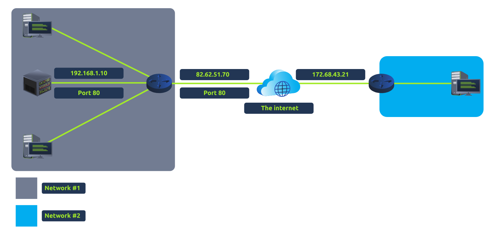


A **firewall** is a device within a network responsible for determining what traffic is allowed to enter and exit. Think of a firewall as border security for a network. An administrator can configure a firewall to permit or deny traffic from entering or exiting a network based on numerous factors such as:
- Where the traffic is coming from? (has the firewall been told to accept/deny traffic from a specific network?)
- Where is the traffic going to? (has the firewall been told to accept/deny traffic destined for a specific network?)
- What port is the traffic for? (has the firewall been told to accept/deny traffic destined for port 80 only?)
- What protocol is the traffic using? (has the firewall been told to accept/deny traffic that is UDP, TCP or both?)
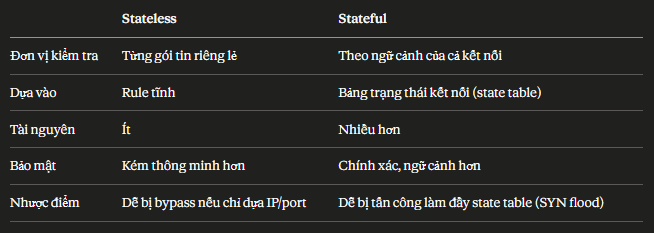
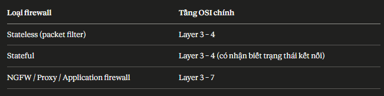


**VPN Basic**
A Virtual Private Network (or VPN for short) is a technology that allows devices on separate networks to communicate securely by creating a dedicated path between each other over the Internet (known as a tunnel). Devices connected within this tunnel form their own private network.
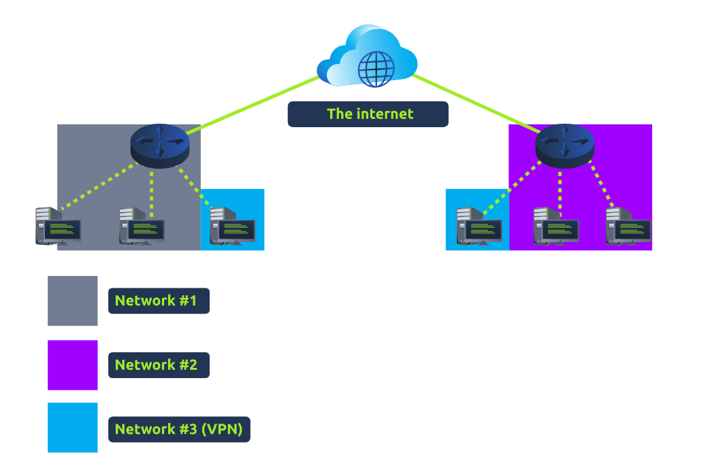
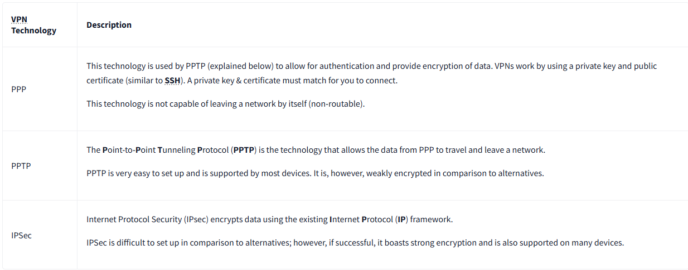

**DNS (Domain Name System)**
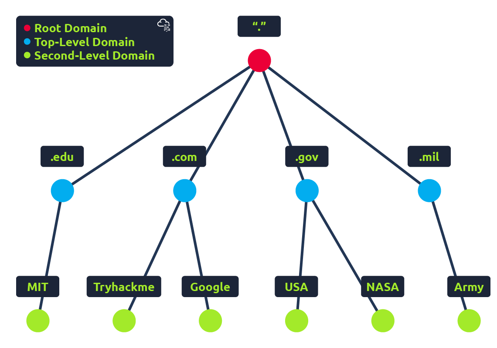
- TLD (Top-Level Domain): A TLD is the most righthand part of a domain name. So, for example, the tryhackme.com TLD is .com. There are two types of TLD, gTLD (Generic Top Level) and ccTLD (Country Code Top Level Domain). Historically a gTLD was meant to tell the user the domain name's purpose; for example, a .com would be for commercial purposes, .org for an organisation, .edu for education and .gov for government. And a ccTLD was used for geographical purposes, for example, .ca for sites based in Canada, .co.uk for sites based in the United Kingdom and so on. Due to such demand, there is an influx of new gTLDs ranging from .online , .club , .website , .biz and so many more. For a full list of over 2000 TLDs click here(opens in new tab).

- Second-Level Domain: Taking tryhackme.com as an example, the .com part is the TLD, and tryhackme is the Second Level Domain. When registering a domain name, the second-level domain is limited to 63 characters + the TLD and can only use a-z 0-9 and hyphens (cannot start or end with hyphens or have consecutive hyphens).

- Subdomain: A subdomain sits on the left-hand side of the Second-Level Domain using a period to separate it; for example, in the name admin.tryhackme.com the admin part is the subdomain. A subdomain name has the same creation restrictions as a Second-Level Domain, being limited to 63 characters and can only use a-z 0-9 and hyphens (cannot start or end with hyphens or have consecutive hyphens). You can use multiple subdomains split with periods to create longer names, such as jupiter.servers.tryhackme.com. But the length must be kept to 253 characters or less. There is no limit to the number of subdomains you can create for your domain name.


**DNS Record Types**
DNS isn't just for websites though, and multiple types of DNS record exist. We'll go over some of the most common ones that you're likely to come across.

- **A Record**: These records resolve to IPv4 addresses, for example 104.26.10.229
- **AAAA Record**: These records resolve to IPv6 addresses, for example 2606:4700:20::681a:be5
- **CNAME Record**: These records resolve to another domain name, for example, TryHackMe's online shop has the subdomain name store.tryhackme.com which returns a CNAME record shops.shopify.com(opens in new tab). Another DNS request would then be made to shops.shopify.com(opens in new tab) to work out the IP address.
- **MX Record**: These records resolve to the address of the servers that handle the email for the domain you are querying, for example an MX record response for tryhackme.com would look something like alt1.aspmx.l.google.com(opens in new tab). These records also come with a priority flag. This tells the client in which order to try the servers, this is perfect for if the main server goes down and email needs to be sent to a backup server.
- **TXT Record**: TXT records are free text fields where any text-based data can be stored. TXT records have multiple uses, but some common ones can be to list servers that have the authority to send an email on behalf of the domain (this can help in the battle against spam and spoofed email). They can also be used to verify ownership of the domain name when signing up for third party services. Here are a few examples:
    - _acme-challenge.example.com TXT "token_value_here"
    - @ TXT "v=spf1 ip4:192.0.2.0/24 include:_spf.google.com include:amazonses.com ~all"
    - _dmarc.example.com TXT "v=DMARC1; p=reject; rua=mailto:dmarc-reports@example.com; adkim=s; aspf=s; pct=100"
    - @ TXT "MS=ms12345678"

As you can see, as the name implies, TXT records are strings of text.
 
 **DNS request:**
 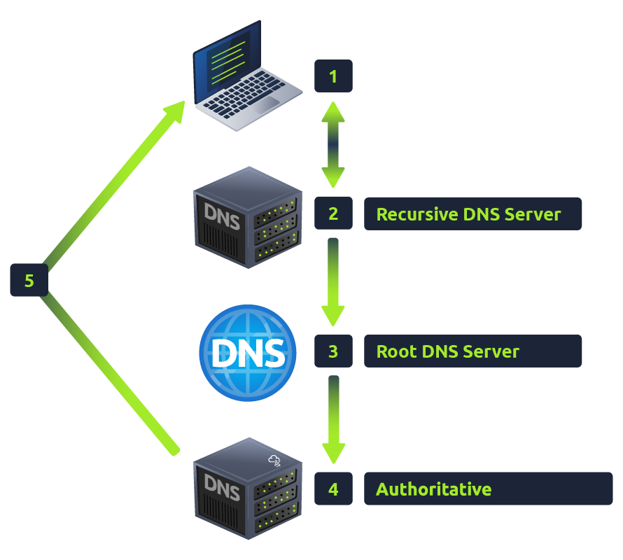

**What is a URL? (Uniform Resource Locator)**

Example 1: 
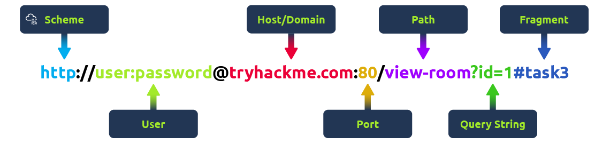
- Scheme: This instructs on what protocol to use for accessing the resource such as HTTP, HTTPS, FTP (File Transfer Protocol).
- Path: The file name or location of the resource you are trying to access.
- Fragment: This is a reference to a location on the actual page requested. This is commonly used for pages with long content and can have a certain part of the page directly linked to it, so it is viewable to the user as soon as they access the page.

Example 2: 
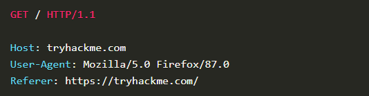
- Line 2: We tell the web server we want the website tryhackme.com
- Line 3: We tell the web server we are using the Firefox version 87 Browser
- Line 4: We are telling the web server that the web page that referred us to this one is https://tryhackme.com

**How website work**
There are two major components that make up a website:
- Front End (Client-Side) - the way your browser renders a website.
- Back End (Server-Side) - a server that processes your request and returns a response.

**CDN (Content Delivery Networks)**: A CDN can be an excellent resource for cutting down traffic to a busy website. It allows you to host static files from your website, such as JavaScript, CSS, Images, Videos, and host them across thousands of servers all over the world. When a user requests one of the hosted files, the CDN works out where the nearest server is physically located and sends the request there instead of potentially the other side of the world.

**Linux command:**

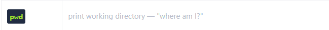
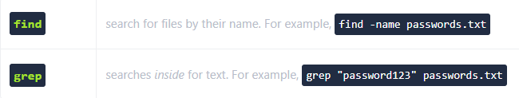
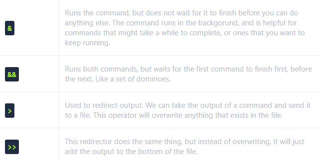
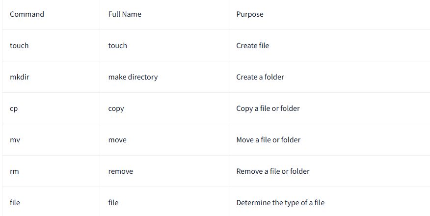
- **Downloading Files (Wget)**
- **Transferring Files From Your Host - SCP (SSH)**: Working on a model of SOURCE and DESTINATION, SCP allows you to:
    - Copy files & directories from your current system to a remote system
    - Copy files & directories from a remote system to your current system
- **Process:** 
    - To see the processes run by other users and those that don't run from a session (i.e. system processes), we need to provide aux to the ps command like so: ps aux
    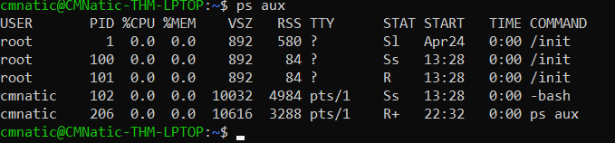
    - You can send signals that terminate processes; there are a variety of types of signals that correlate to exactly how "cleanly" the process is dealt with by the kernel. To kill a command, we can use the appropriately named kill command and the associated PID that we wish to kill. i.e., to kill PID 1337, we'd use kill 1337. Below are some of the signals that we can send to a process when it is killed:
        - SIGTERM - Kill the process, but allow it to do some cleanup tasks beforehand
        - SIGKILL - Kill the process - doesn't do any cleanup after the fact
        - SIGSTOP - Stop/suspend a process
- **systemctl**: this command allows us to interact with the systemd process/daemon. systemctl is an easy to use command that takes the following formatting: 
    ```
    systemctl [option] [service]
    ```
    
    - We can do five options with systemctl:
        - Start
        - Stop
        - Enable
        - Disable
        - Status

    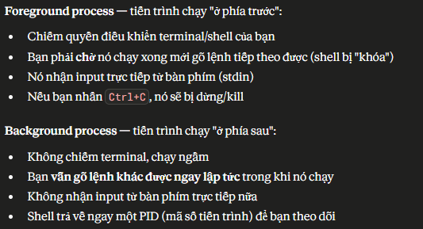


**Linux permission:**
Each letter represents a specific permission:
- r = read
- w = write
- x = execute

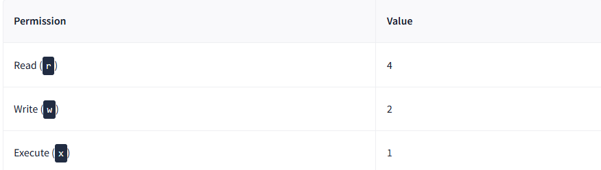
**Example:** rwxrwxrwx
This format is split into three groups:
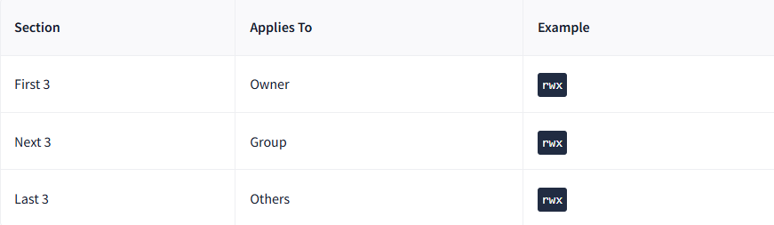
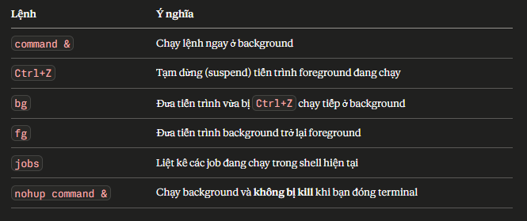

**Linux automation:**
Users may want to schedule a certain action or task to take place after the system has booted. Take, for example, running commands, backing up files, or launching your favourite programs on, such as Spotify or Google Chrome.

We're going to be talking about the cron process, but more specifically, how we can interact with it via the use of crontabs . Crontab is one of the processes that is started during boot, which is responsible for facilitating and managing cron jobs.
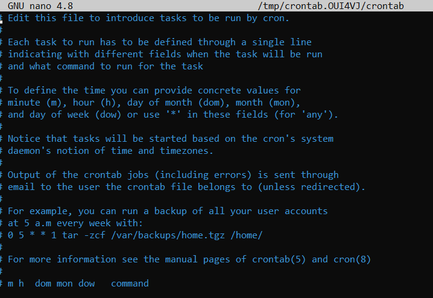
A crontab is simply a special file with formatting that is recognised by the cron process to execute each line step-by-step. Crontabs require 6 specific values:
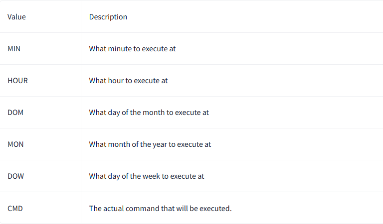
Let's use the example of backing up files. You may wish to backup "cmnatic"'s  "Documents" every 12 hours. We would use the following formatting: 
```
0 */12 * * * cp -R /home/cmnatic/Documents /var/backups/
```
Crontabs can be edited by using `crontab -e`, where you can select an editor (such as Nano) to edit your crontab.
> [!NOTE]
> Vocabulary:
1. anonymity /ˌænəˈnɪməti/: danh tính
2. resovle to: trỏ đến/tương ứng
3. ditching the in-browser: loại bỏ thao tác trong trình duyệt
4. presumption: something that is thought to be true or likely (giả định)